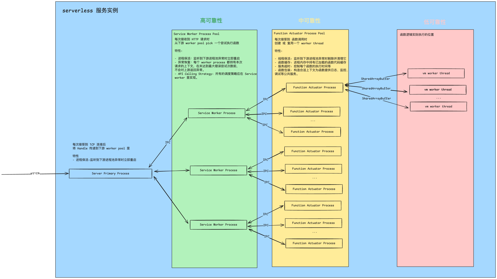

# 背景

准备自研 serverless 平台 平台。这个代码仓库用于学习 & 验证 nodejs@22 中一些关键的技术。


# 需要验证的项

## Multi-process http server

nodejs@22 支持 cluster, 用于 创建多个 nodejs 实例。 我实现了一个[官方示例](/src/1_multi_process_http_server.js)，以下是实验结果。

```bash
> node src/1_multi_process_http_server.js
Primary 67689 is running
Worker 67690 started
Worker 67691 started
Worker 67693 started
Worker 67692 started
Worker 67695 started
Worker 67696 started
Worker 67694 started
Worker 67697 started
```

尝试访问

```bash
> curl http://localhost:8000
hello world from 67690
>curl http://localhost:8000
hello world from 67691
>curl http://localhost:8000
hello world from 67693
>curl http://localhost:8000
hello world from 67692
>curl http://localhost:8000
hello world from 67695
>curl http://localhost:8000
hello world from 67696
>curl http://localhost:8000
hello world from 67694
>curl http://localhost:8000
hello world from 67697
>curl http://localhost:8000
hello world from 67690
>curl http://localhost:8000
hello world from 67691
```

就像官方文档所述, 在 mac 上, 默认使用了轮循方法做负载均衡。


## Worker process keep alive

worker 进程保持存活是服务高可用的关键。我写了一些[示例](./src/2_worker_process_keep_alive/), 验证了以下情况:

- OOM: worker process oom 的时候会触发 退出事件, 并且 signal=SIGABRT

- `process.exit()`: worker process 主动调用 exit 时，会主进程会触发 disconnect 事件，然后触发 exit 事件

```bash
> node src/2_worker_process_keep_alive/exit_0.js
Primary 79699 is running
worker 79700 disconnect
worker 79704 disconnect
worker 79702 disconnect
worker 79700 died because of null, code: 0
worker 79702 died because of null, code: 0
worker 79704 died because of null, code: 0
worker 79703 disconnect
worker 79705 disconnect
worker 79703 died because of null, code: 0
worker 79705 died because of null, code: 0
worker 79701 disconnect
worker 79707 disconnect
worker 79706 disconnect
worker 79701 died because of null, code: 0
worker 79706 died because of null, code: 0
worker 79707 died because of null, code: 0

> node src/2_worker_process_keep_alive/exit_SIGABRT.js 
Primary 79757 is running
worker 79761 disconnect
worker 79763 disconnect
worker 79763 died because of null, code: 1
worker 79761 died because of null, code: 1
worker 79758 disconnect
worker 79762 disconnect
worker 79758 died because of null, code: 1
worker 79764 disconnect
worker 79762 died because of null, code: 1
worker 79764 died because of null, code: 1
worker 79765 disconnect
worker 79765 died because of null, code: 1
worker 79760 disconnect
worker 79760 died because of null, code: 1
worker 79759 disconnect
worker 79759 died because of null, code: 1
```

- throw error: worker process 抛错事实上是不触发 `worker.on('error')` 的, 从官方文档来看, 只有以下四件事发生，error 才会发生。

```
The 'error' event is emitted whenever:
无论何时， 'error' 事件都会发出：

The process could not be spawned.
进程无法启动。

The process could not be killed.
进程无法被杀死。

Sending a message to the child process failed.
向子进程发送信息失败。

The child process was aborted via the signal option.
子进程已通过 signal 选项中止。

The 'exit' event may or may not fire after an error has occurred. When listening to both the 'exit' and 'error' events, guard against accidentally invoking handler functions multiple times.
发生错误后， 'exit' 事件可能触发，也可能不触发。同时监听 'exit' 和 'error' 事件时，要防止意外多次调用处理程序函数。
```


# 总结

1. linux 与 mac 的 cluster fork 后对 listen 的负载处理默认采用的是轮训。

2. 大多数时候, primary process 无法感知到 worker 的 "错误"。更复杂的错误处理都需要在 worker process 里做。

3. worker process oom 后会 触发 exit 事件, 并且 signal=SIGABRT。

基于以上的验证结果, 目前的一个架构想法是:



# 关于 VM 部分

目前计划学习研究 https://github.com/labring/laf/tree/main/runtimes/nodejs 相关的设计和实现。选用适合我们的部分新实现一个更轻量的版本。

## laf 的 serverless function 执行过程

laf 支持的是一种多文件风格的 serverless，它支持用户上传多个代码文件，并且保留了相对于项目的文件路径。因此其函数执行单位是 function module。

laf 的函数执行流程大体如下: 1. 引入 function module 2. 取 function module 身上的 default 或 main 函数作为入口 3. 将 serverless context 交给 serverless function 来执行。

```typescript
  async invoke(
    context: FunctionContext,
    useInterceptor: boolean,
  ): Promise<FunctionResult> {
    const startTime = process.hrtime.bigint()

    try {
      const mod = this.getModule()
      const main = mod.default || mod.main
      if (!main) {
        throw new Error('FunctionExecutionError: `main` function not found')
      }

      if (typeof main !== 'function') {
        throw new Error(
          'FunctionExecutionError: `main` function must be callable',
        )
      }

      let data = null
      if (this.data.name === INTERCEPTOR_FUNCTION_NAME) {
        data = await main(context, () => {})
      } else if (useInterceptor) {
        data = await this.invokeWithInterceptor(context, main)
      } else {
        data = await main(context)
      }

      const endTime = process.hrtime.bigint()
      const timeUsage = nanosecond2ms(endTime - startTime)
      return {
        data,
        time_usage: timeUsage,
      }
    } catch (error) {
      const endTime = process.hrtime.bigint()
      const timeUsage = nanosecond2ms(endTime - startTime)

      return {
        error,
        time_usage: timeUsage,
      }
    }
  }
```

laf 的 serverless function context 就是一个通过 express ctx 包装的对象。

```typescript
/**
 * ctx passed to function
 */
export interface FunctionContext {
  files?: File[]
  headers?: IncomingHttpHeaders
  query?: any
  body?: any
  user?: any
  params?: any
  requestId?: string
  method?: string
  socket?: WebSocket
  request?: Request
  response?: Response
  __function_name?: string
  [key: string]: any
}
```


laf 处理的 function module 的核型流程如下，主要是 1.包装代码 2.构建执行上下文 3.runInNewContext

```typescript
  static compile(
    functionName: string,
    code: string,
    fromModules: string[],
    consoleInstance?: Console,
  ): any {
    const wrapped = this.wrap(code)
    const sandbox = this.buildSandbox(
      functionName,
      fromModules,
      consoleInstance,
    )
    const options: RunningScriptOptions = {
      filename: functionName,
      displayErrors: true,
      contextCodeGeneration: {
        strings: true,
        wasm: true,
      },
    } as any

    const script = this.createScript(wrapped, options)
    return script.runInNewContext(sandbox, options)
  }
```

laf 在包装代码过程中插入了对 require 的定义。

```typescript
protected static wrap(code: string): string {
    // ensure 1 line to balance line offset of error stack
    return [
    `function require(name){__from_modules.push(__filename);return __require(name,__from_modules,__filename);}`,
    `${code}`,
    `\nmodule.exports;`,
    ].join(' ')
}
```

laf 在构建执行上下文时主要定义了 `__require` 方法用于处理模块引入。

```typescript
 /**
 * Build function module global sandbox
 */
protected static buildSandbox(
functionName: string,
fromModules: string[],
consoleInstance?: Console,
): FunctionModuleGlobalContext {
const _module = {
    exports: {},
}

const fConsole = consoleInstance || new Console(functionName)
const __from_modules = fromModules || []

const sandbox: FunctionModuleGlobalContext = {
    __filename: functionName,
    module: _module,
    exports: _module.exports,
    console: fConsole,
    __require: this.require.bind(this),
    RegExp: RegExp,
    Buffer: Buffer,
    setImmediate: setImmediate,
    clearImmediate: clearImmediate,
    Float32Array: Float32Array,
    setInterval: setInterval,
    clearInterval: clearInterval,
    setTimeout: setTimeout,
    clearTimeout: clearTimeout,
    process: process,
    URL: URL,
    fetch: globalThis.fetch,
    global: null,
    __from_modules: [...__from_modules],
    ObjectId: ObjectId,
}
sandbox.global = sandbox
return sandbox
}
```

laf 的 require 主要处理三种模块名: 1. '@/cloud-sdk' 直接引入 '@lafjs/cloud' 2. '@/' './' '../' 改为相对目录或绝对目录引用。3. 其他模块, 使用 customRequire 引入。

``` typescript
  static require(moduleName: string, fromModule: string[], filename = ''): any {
    if (moduleName === '@/cloud-sdk') {
      return require('@lafjs/cloud')
    } else if (
      moduleName.startsWith('@/') ||
      moduleName.startsWith('./') ||
      moduleName.startsWith('../')
    ) {
      // get function name
      let fn = ''
      if (moduleName.startsWith('@/')) {
        fn = moduleName.replace('@/', '')
      } else {
        const dirname = '/'
        const filePath = path.join(path.dirname(dirname + filename), moduleName)
        fn = filePath.slice(dirname.length)
      }

      // check cache
      if (FunctionModule.cache.has(fn)) {
        return FunctionModule.cache.get(fn)
      }

      // check circular dependency
      if (fromModule?.indexOf(fn) !== -1) {
        throw new Error(
          `circular dependency detected: ${fromModule.join(' -> ')} -> ${fn}`,
        )
      }

      // build function module
      const data = FunctionCache.get(fn)
      if (!data) {
        throw new Error(`function ${fn} not found`)
      }
      const mod = this.compile(fn, data.source.compiled, fromModule)

      // cache module
      if (!Config.DISABLE_MODULE_CACHE) {
        FunctionModule.cache.set(fn, mod)
      }
      return mod
    }

    // load custom dependency from custom dependency path first
    try {
      return FunctionModule.customRequire(moduleName)
    } catch (e) {
      return require(moduleName)
    }
  }
```

laf 的 customRequire 引入实际上是使用 node:module 的 createRequire 创建的一个指定了基址的 require 方法，用于支持用户自定义的一些三方库。

```typescript
import { createRequire } from 'node:module'

export default class Config {
  static get CUSTOM_DEPENDENCY_BASE_PATH(): string {
    return process.env.CUSTOM_DEPENDENCY_BASE_PATH || '/tmp/custom_dependency'
  }
}


export const CUSTOM_DEPENDENCY_NODE_MODULES_PATH = `${Config.CUSTOM_DEPENDENCY_BASE_PATH}/node_modules/`

export class FunctionModule {
    static customRequire = createRequire(CUSTOM_DEPENDENCY_NODE_MODULES_PATH)
}
```

## laf 的 中间件设计

1. cors
2. req.headers['x-real-ip']
3. express.json({ limit: Config.REQUEST_LIMIT_SIZE })
4. express.urlencoded
5. express.raw
6. xmlparser
7. req.headers['authorization']
8. req['requestId'] 和 res.set('request-id', requestId)
9. multer 多文件上传支持


## laf 的 路由设计

- `/proxy/:policy` 云数据库代理
- `/_/typing/package` 线上写函数脚本时候使用到的type支持，会返回一些三方包的 type 定义。
- `/_/healthz` 检测数据库
- `/_/api-docs` 使用 'openapi3-ts/oas30' 构建的 openapi 的文档页
- `*` 函数实际挂载的位置,函数名字最大长度不超过 256。函数名中可以包含`/`字符。


## 总结

laf nodejs runtime 单纯的实现了 serverless function call 的最小链路，其主要的特性有：

1. 函数自身的实现支持 cjs 格式 & 多代码文件，开发者可以不用 bundle 自己的代码。
2. 支持 Module Cache，模块级别的执行逻辑在多次接口调用过程中，只会被执行一次。

对于我们来说其不可用的特性有:

1. API Loader: laf 的 api loader 是对数据库的 CURD。
2. Database Proxy: laf 的 数据库代理有着自己的逻辑。

对于我们来说其不支持的特性有:

1. 函数的执行超时。
2. 函数执行的线程隔离与内存控制。
3. 函数预热。

基于以上总结, 进一步的想法是:

1. 使用 pool.runTime


# 关于线程池的限制 & 进程池

1. 即使限制了线程的资源使用，服务进程也有可能被 oom 的函数拉崩溃，届时所有被分配到这个服务进程的请求都会立即断开。如[server](./src/3_multi_process_and_worker_http_server/server.js) 所示，其执行结果如下

服务端
```
> node src/3_multi_process_and_worker_http_server/server.js 
Primary 43243 is running
Service Process 43244 started
Service Process 43249 started
Service Process 43251 started
Service Process 43247 started
Service Process 43250 started
Service Process 43245 started
Service Process 43246 started
Service Process 43248 started

<--- Last few GCs --->

[43244:0x118040000]     3576 ms: Mark-Compact 1073.1 (1586.7) -> 1073.1 (2098.0) MB, pooled: 2 MB, 273.38 / 0.00 ms  (average mu = 0.671, current mu = 0.200) allocation failure; scavenge might not succeed


<--- JS stacktrace --->

FATAL ERROR: Reached heap limit Allocation failed - JavaScript heap out of memory
----- Native stack trace -----

 1: 0x100a971e4 node::OOMErrorHandler(char const*, v8::OOMDetails const&) [/Users/bilibili/.nvm/versions/node/v22.14.0/bin/node]
 2: 0x100c96fd8 v8::internal::V8::FatalProcessOutOfMemory(v8::internal::Isolate*, char const*, v8::OOMDetails const&) [/Users/bilibili/.nvm/versions/node/v22.14.0/bin/node]
 3: 0x100ea4f30 v8::internal::Heap::stack() [/Users/bilibili/.nvm/versions/node/v22.14.0/bin/node]
 4: 0x100ea32d0 v8::internal::Heap::CollectGarbage(v8::internal::AllocationSpace, v8::internal::GarbageCollectionReason, v8::GCCallbackFlags) [/Users/bilibili/.nvm/versions/node/v22.14.0/bin/node]
 5: 0x100e978b8 v8::internal::HeapAllocator::AllocateRawWithLightRetrySlowPath(int, v8::internal::AllocationType, v8::internal::AllocationOrigin, v8::internal::AllocationAlignment) [/Users/bilibili/.nvm/versions/node/v22.14.0/bin/node]
 6: 0x100e980f0 v8::internal::HeapAllocator::AllocateRawWithRetryOrFailSlowPath(int, v8::internal::AllocationType, v8::internal::AllocationOrigin, v8::internal::AllocationAlignment) [/Users/bilibili/.nvm/versions/node/v22.14.0/bin/node]
 7: 0x100e68a8c v8::internal::FactoryBase<v8::internal::Factory>::NewFixedArray(int, v8::internal::AllocationType) [/Users/bilibili/.nvm/versions/node/v22.14.0/bin/node]
 8: 0x101009f80 v8::internal::(anonymous namespace)::ElementsAccessorBase<v8::internal::(anonymous namespace)::FastHoleyObjectElementsAccessor, v8::internal::(anonymous namespace)::ElementsKindTraits<(v8::internal::ElementsKind)3>>::ConvertElementsWithCapacity(v8::internal::Handle<v8::internal::JSObject>, v8::internal::Handle<v8::internal::FixedArrayBase>, v8::internal::ElementsKind, unsigned int, unsigned int, unsigned int) [/Users/bilibili/.nvm/versions/node/v22.14.0/bin/node]
 9: 0x101009ddc v8::internal::(anonymous namespace)::ElementsAccessorBase<v8::internal::(anonymous namespace)::FastHoleyObjectElementsAccessor, v8::internal::(anonymous namespace)::ElementsKindTraits<(v8::internal::ElementsKind)3>>::GrowCapacityAndConvertImpl(v8::internal::Handle<v8::internal::JSObject>, unsigned int) [/Users/bilibili/.nvm/versions/node/v22.14.0/bin/node]
10: 0x101009b58 v8::internal::(anonymous namespace)::ElementsAccessorBase<v8::internal::(anonymous namespace)::FastHoleyObjectElementsAccessor, v8::internal::(anonymous namespace)::ElementsKindTraits<(v8::internal::ElementsKind)3>>::SetLengthImpl(v8::internal::Isolate*, v8::internal::Handle<v8::internal::JSArray>, unsigned int, v8::internal::Handle<v8::internal::FixedArrayBase>) [/Users/bilibili/.nvm/versions/node/v22.14.0/bin/node]
11: 0x100fe4980 v8::internal::ArrayConstructInitializeElements(v8::internal::Handle<v8::internal::JSArray>, v8::internal::Arguments<(v8::internal::ArgumentsType)1>*) [/Users/bilibili/.nvm/versions/node/v22.14.0/bin/node]
12: 0x101288eb4 v8::internal::Runtime_NewArray(int, unsigned long*, v8::internal::Isolate*) [/Users/bilibili/.nvm/versions/node/v22.14.0/bin/node]
13: 0x101759af4 Builtins_CEntry_Return1_ArgvOnStack_NoBuiltinExit [/Users/bilibili/.nvm/versions/node/v22.14.0/bin/node]
14: 0x10183b440 Builtins_ConstructHandler [/Users/bilibili/.nvm/versions/node/v22.14.0/bin/node]
15: 0x1016c4ef0 Builtins_InterpreterEntryTrampoline [/Users/bilibili/.nvm/versions/node/v22.14.0/bin/node]
16: 0x1016c4ef0 Builtins_InterpreterEntryTrampoline [/Users/bilibili/.nvm/versions/node/v22.14.0/bin/node]
17: 0x101701290 Builtins_AsyncFunctionAwaitResolveClosure [/Users/bilibili/.nvm/versions/node/v22.14.0/bin/node]
18: 0x1017cc4d8 Builtins_PromiseFulfillReactionJob [/Users/bilibili/.nvm/versions/node/v22.14.0/bin/node]
19: 0x1016f1594 Builtins_RunMicrotasks [/Users/bilibili/.nvm/versions/node/v22.14.0/bin/node]
20: 0x1016c2af4 Builtins_JSRunMicrotasksEntry [/Users/bilibili/.nvm/versions/node/v22.14.0/bin/node]
21: 0x100dfce6c v8::internal::(anonymous namespace)::Invoke(v8::internal::Isolate*, v8::internal::(anonymous namespace)::InvokeParams const&) [/Users/bilibili/.nvm/versions/node/v22.14.0/bin/node]
22: 0x100dfd714 v8::internal::(anonymous namespace)::InvokeWithTryCatch(v8::internal::Isolate*, v8::internal::(anonymous namespace)::InvokeParams const&) [/Users/bilibili/.nvm/versions/node/v22.14.0/bin/node]
23: 0x100dfd84c v8::internal::Execution::TryRunMicrotasks(v8::internal::Isolate*, v8::internal::MicrotaskQueue*) [/Users/bilibili/.nvm/versions/node/v22.14.0/bin/node]
24: 0x100e2aac8 v8::internal::MicrotaskQueue::RunMicrotasks(v8::internal::Isolate*) [/Users/bilibili/.nvm/versions/node/v22.14.0/bin/node]
25: 0x100e2b24c v8::internal::MicrotaskQueue::PerformCheckpoint(v8::Isolate*) [/Users/bilibili/.nvm/versions/node/v22.14.0/bin/node]
26: 0x1009a19a8 node::InternalCallbackScope::Close() [/Users/bilibili/.nvm/versions/node/v22.14.0/bin/node]
27: 0x1009a1cc4 node::InternalMakeCallback(node::Environment*, v8::Local<v8::Object>, v8::Local<v8::Object>, v8::Local<v8::Function>, int, v8::Local<v8::Value>*, node::async_context, v8::Local<v8::Value>) [/Users/bilibili/.nvm/versions/node/v22.14.0/bin/node]
28: 0x1009b6fd4 node::AsyncWrap::MakeCallback(v8::Local<v8::Function>, int, v8::Local<v8::Value>*) [/Users/bilibili/.nvm/versions/node/v22.14.0/bin/node]
29: 0x100ae3a18 node::worker::MessagePort::OnMessage(node::worker::MessagePort::MessageProcessingMode) [/Users/bilibili/.nvm/versions/node/v22.14.0/bin/node]
30: 0x1016a010c uv__async_io [/Users/bilibili/.nvm/versions/node/v22.14.0/bin/node]
31: 0x1016b3920 uv__io_poll [/Users/bilibili/.nvm/versions/node/v22.14.0/bin/node]
32: 0x1016a0674 uv_run [/Users/bilibili/.nvm/versions/node/v22.14.0/bin/node]
33: 0x1009a2508 node::SpinEventLoopInternal(node::Environment*) [/Users/bilibili/.nvm/versions/node/v22.14.0/bin/node]
34: 0x100b927f8 node::worker::Worker::Run() [/Users/bilibili/.nvm/versions/node/v22.14.0/bin/node]
35: 0x100b95f28 node::worker::Worker::StartThread(v8::FunctionCallbackInfo<v8::Value> const&)::$_0::__invoke(void*) [/Users/bilibili/.nvm/versions/node/v22.14.0/bin/node]
36: 0x19c27df94 _pthread_start [/usr/lib/system/libsystem_pthread.dylib]
37: 0x19c278d34 thread_start [/usr/lib/system/libsystem_pthread.dylib]
Service Process 43244 disconnect
Service Process 43244 died because of SIGABRT, code: null
Service Process 43267 rebooted
Service Process 43267 started
```

客户端
```
> curl http://localhost:8000
curl: (52) Empty reply from server
```

2. 而使用线程池可以以IPC成本换取稳定性。如 [server2](./src/3_multi_process_and_worker_http_server/server2.js) 所示，其执行结果如下。

服务端
```
> node src/3_multi_process_and_worker_http_server/server2.js
Primary 43581 is running
Service Process 43588 started
Service Process 43584 started
Service Process 43583 started
Service Process 43587 started
Service Process 43586 started
Service Process 43585 started
Service Process 43589 started
Service Process 43582 started

<--- Last few GCs --->

[43590:0x150008000]     8767 ms: Mark-Compact (reduce) 4123.7 (4129.5) -> 4123.7 (4126.5) MB, pooled: 0 MB, 1497.62 / 0.00 ms  (+ 1.0 ms in 0 steps since start of marking, biggest step 0.0 ms, walltime since start of marking 1621 ms) (average mu = 0.261, 

<--- JS stacktrace --->

FATAL ERROR: Reached heap limit Allocation failed - JavaScript heap out of memory
----- Native stack trace -----

 1: 0x1007771e4 node::OOMErrorHandler(char const*, v8::OOMDetails const&) [/Users/bilibili/.nvm/versions/node/v22.14.0/bin/node]
 2: 0x100976fd8 v8::internal::V8::FatalProcessOutOfMemory(v8::internal::Isolate*, char const*, v8::OOMDetails const&) [/Users/bilibili/.nvm/versions/node/v22.14.0/bin/node]
 3: 0x100b84f30 v8::internal::Heap::stack() [/Users/bilibili/.nvm/versions/node/v22.14.0/bin/node]
 4: 0x100b832d0 v8::internal::Heap::CollectGarbage(v8::internal::AllocationSpace, v8::internal::GarbageCollectionReason, v8::GCCallbackFlags) [/Users/bilibili/.nvm/versions/node/v22.14.0/bin/node]
 5: 0x100b0c82c v8::internal::StackGuard::HandleInterrupts(v8::internal::StackGuard::InterruptLevel) [/Users/bilibili/.nvm/versions/node/v22.14.0/bin/node]
 6: 0x100f7654c v8::internal::Runtime_StackGuard(int, unsigned long*, v8::internal::Isolate*) [/Users/bilibili/.nvm/versions/node/v22.14.0/bin/node]
 7: 0x101439af4 Builtins_CEntry_Return1_ArgvOnStack_NoBuiltinExit [/Users/bilibili/.nvm/versions/node/v22.14.0/bin/node]
 8: 0x1013dd08c Builtins_ArrayPrototypePush [/Users/bilibili/.nvm/versions/node/v22.14.0/bin/node]
 9: 0x1013a4ef0 Builtins_InterpreterEntryTrampoline [/Users/bilibili/.nvm/versions/node/v22.14.0/bin/node]
10: 0x10730f620 
11: 0x1013a4ef0 Builtins_InterpreterEntryTrampoline [/Users/bilibili/.nvm/versions/node/v22.14.0/bin/node]
12: 0x1013a4ef0 Builtins_InterpreterEntryTrampoline [/Users/bilibili/.nvm/versions/node/v22.14.0/bin/node]
13: 0x1013a2c0c Builtins_JSEntryTrampoline [/Users/bilibili/.nvm/versions/node/v22.14.0/bin/node]
14: 0x1013a28f4 Builtins_JSEntry [/Users/bilibili/.nvm/versions/node/v22.14.0/bin/node]
15: 0x100adceac v8::internal::(anonymous namespace)::Invoke(v8::internal::Isolate*, v8::internal::(anonymous namespace)::InvokeParams const&) [/Users/bilibili/.nvm/versions/node/v22.14.0/bin/node]
16: 0x100adc808 v8::internal::Execution::Call(v8::internal::Isolate*, v8::internal::Handle<v8::internal::Object>, v8::internal::Handle<v8::internal::Object>, int, v8::internal::Handle<v8::internal::Object>*) [/Users/bilibili/.nvm/versions/node/v22.14.0/bin/node]
17: 0x10098d544 v8::Function::Call(v8::Local<v8::Context>, v8::Local<v8::Value>, int, v8::Local<v8::Value>*) [/Users/bilibili/.nvm/versions/node/v22.14.0/bin/node]
18: 0x100681a80 node::InternalCallbackScope::Close() [/Users/bilibili/.nvm/versions/node/v22.14.0/bin/node]
19: 0x100681cc4 node::InternalMakeCallback(node::Environment*, v8::Local<v8::Object>, v8::Local<v8::Object>, v8::Local<v8::Function>, int, v8::Local<v8::Value>*, node::async_context, v8::Local<v8::Value>) [/Users/bilibili/.nvm/versions/node/v22.14.0/bin/node]
20: 0x100696fd4 node::AsyncWrap::MakeCallback(v8::Local<v8::Function>, int, v8::Local<v8::Value>*) [/Users/bilibili/.nvm/versions/node/v22.14.0/bin/node]
21: 0x100889910 node::StreamBase::CallJSOnreadMethod(long, v8::Local<v8::ArrayBuffer>, unsigned long, node::StreamBase::StreamBaseJSChecks) [/Users/bilibili/.nvm/versions/node/v22.14.0/bin/node]
22: 0x10088b0a4 node::EmitToJSStreamListener::OnStreamRead(long, uv_buf_t const&) [/Users/bilibili/.nvm/versions/node/v22.14.0/bin/node]
23: 0x10088f56c node::LibuvStreamWrap::OnUvRead(long, uv_buf_t const*) [/Users/bilibili/.nvm/versions/node/v22.14.0/bin/node]
24: 0x10088fcb4 node::LibuvStreamWrap::ReadStart()::$_1::__invoke(uv_stream_s*, long, uv_buf_t const*) [/Users/bilibili/.nvm/versions/node/v22.14.0/bin/node]
25: 0x10138b6d8 uv__stream_io [/Users/bilibili/.nvm/versions/node/v22.14.0/bin/node]
26: 0x101393920 uv__io_poll [/Users/bilibili/.nvm/versions/node/v22.14.0/bin/node]
27: 0x101380674 uv_run [/Users/bilibili/.nvm/versions/node/v22.14.0/bin/node]
28: 0x100682508 node::SpinEventLoopInternal(node::Environment*) [/Users/bilibili/.nvm/versions/node/v22.14.0/bin/node]
29: 0x1007c0154 node::NodeMainInstance::Run() [/Users/bilibili/.nvm/versions/node/v22.14.0/bin/node]
30: 0x100736364 node::Start(int, char**) [/Users/bilibili/.nvm/versions/node/v22.14.0/bin/node]
31: 0x19bef3154 start [/usr/lib/dyld]
```

客户端
```
> curl http://localhost:8000
云函数执行进程异常, 这里可以做恢复, 但是我没时间, 先不做
```